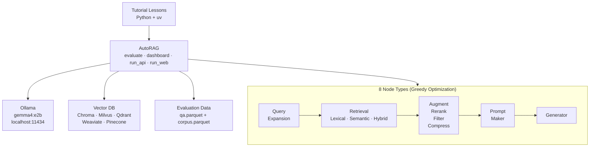

# AutoRAG Tutorial

[](https://www.python.org/downloads/)
[](https://github.com/Marker-Inc-Korea/AutoRAG)
[](https://ollama.ai)

> A two-level tutorial for [AutoRAG](https://github.com/Marker-Inc-Korea/AutoRAG) — the open-source framework that applies AutoML-style automation to RAG pipeline optimization.

You provide evaluation data, AutoRAG explores combinations of chunking strategies, embedding models, retrievers, rerankers, and generators, then identifies the best configuration for your data. This tutorial takes you from zero to production-ready RAG pipelines across 13 hands-on lessons.

## Features

- **13 self-contained lessons** — each runnable with `uv sync && uv run python main.py`
- **Progressive difficulty** — Level 1 covers essentials (~5-6h), Level 2 covers advanced optimization and production (~4.25-5h)
- **Local-first** — runs entirely on your machine with Ollama (no API keys required)
- **All 8 node types** — query expansion, retrieval, augmentation, reranking, filtering, compression, prompt making, generation
- **Real evaluations** — every lesson includes sample data and produces actual AutoRAG results
- **Production path** — from local optimization to FastAPI/Gradio deployment to OpenShift AI

## Architecture



## Quick Start

### Prerequisites

- Python 3.10+
- [uv](https://docs.astral.sh/uv/) — Python package manager
- [Ollama](https://ollama.ai) — local LLM inference

### Setup

```bash
# Clone the repo
git clone https://github.com/lukaskellerstein/autorag-tutorial.git
cd autorag-tutorial

# Start Ollama and pull the model
ollama serve &
ollama pull gemma4:e2b

# Verify the setup
cd infra
uv sync
uv run python main.py
```

### Run a Lesson

```bash
cd tutorial/level_1/M1_fundamentals/1_what_is_autorag/
uv sync
uv run python main.py
```

## Usage

### Running an AutoRAG Evaluation

```python
from autorag.evaluator import Evaluator

evaluator = Evaluator(
    qa_data_path="qa.parquet",
    corpus_data_path="corpus.parquet",
    project_dir="./results",
)
evaluator.start_trial("config.yaml")
```

### Key CLI Commands

```bash
# Run evaluation
autorag evaluate --config config.yaml --qa qa.parquet --corpus corpus.parquet

# View results dashboard
autorag dashboard --trial_dir results/

# Deploy as FastAPI server
autorag run_api --trial_dir results/

# Launch Gradio web UI
autorag run_web --trial_path results/0

# Extract optimal configuration
autorag extract_best_config --trial_path results/0
```

## Configuration

AutoRAG experiments are driven by a YAML file with two top-level sections:

```yaml
# Vector database backend
vectordb:
  - name: default
    db_type: chroma
    client_type: persistent
    path: ./chroma_db

# Pipeline nodes to evaluate
node_lines:
- node_line_name: retrieve_node_line
  nodes:
    - node_type: query_expansion
      modules:
        - module_type: pass_query_expansion
        - module_type: hyde
    - node_type: lexical_retrieval
      modules:
        - module_type: bm25
          top_k: [3, 5, 10]
    - node_type: passage_reranker
      modules:
        - module_type: pass_reranker
        - module_type: flashrank_reranker

- node_line_name: post_retrieve_node_line
  nodes:
    - node_type: prompt_maker
      modules:
        - module_type: fstring
    - node_type: generator
      modules:
        - module_type: llama_index_llm
          llm: ollama
          model: gemma4:e2b
```

Every node supports a `pass_*` module that skips processing — AutoRAG tests whether each step actually helps on your data.

## Syllabus

### Level 1 — Essentials (~5-6 hours)

Understand AutoRAG, create evaluation data, run experiments, find the optimal RAG pipeline.

| Module | Lessons | Topics |
|--------|---------|--------|
| **M1: Fundamentals** | 1.1 What is AutoRAG | AutoML for RAG, 8 node types, pass modules, greedy optimization |
| | 1.2 Installing & Setup | Project structure, data formats, vectordb config, CLI overview |
| **M2: Evaluation Data** | 2.1 Parsing & Corpus Creation | Parsing pipeline, chunking pipeline, corpus format |
| | 2.2 Creating QA Datasets | Fluent QA generation API, query types, filtering |
| **M3: Experiments** | 3.1 Configuration YAML | All 8 node types, pass modules, optimization strategies |
| | 3.2 Running & Monitoring | Evaluation execution, progress tracking, dashboard |
| | 3.3 Analyzing & Deploying | Result interpretation, FastAPI/Gradio deployment, config export |

### Level 2 — Practitioner (~4.25-5 hours)

Advanced optimization strategies, custom modules, and production deployment on OpenShift AI.

| Module | Lessons | Topics |
|--------|---------|--------|
| **M1: Advanced Optimization** | 1.1 Intermediate Pipeline Nodes | Query expansion, augmenter, filter, compressor, prompt maker |
| | 1.2 Advanced Retrieval | Hybrid search (RRF/CC), 17+ rerankers, multi-stage retrieval |
| | 1.3 Embedding Comparison | Model benchmarking, VectorDB config, cost-quality trade-offs |
| | 1.4 Custom Metrics | Domain-specific metrics, LLM-as-judge |
| **M2: Integration** | 2.1 Custom Modules | Custom chunkers, retrievers, generators |
| | 2.2 AutoRAG to OpenShift | Optimization-to-production deployment workflow |

Full details in [`syllabus.md`](syllabus.md).

## Project Structure

```
syllabus.md                              # Master syllabus
infra/                                   # Setup verification
  main.py                               #   Checks Ollama + AutoRAG
  pyproject.toml
tutorial/
  level_1/
    M1_fundamentals/
      1_what_is_autorag/                 # Each lesson is self-contained:
      2_installing_project_setup/        #   pyproject.toml, main.py,
    M2_evaluation_data/                  #   README.md, .gitignore
      1_parsing_corpus_creation/
      2_creating_qa_datasets/
    M3_running_experiments/
      1_configuration_yaml/
      2_running_monitoring/
      3_analyzing_deploying/
  level_2/
    M1_advanced_optimization/
      1_intermediate_pipeline_nodes/
      2_advanced_retrieval/
      3_embedding_comparison/
      4_custom_metrics/
    M2_integration_production/
      1_custom_modules/
      2_autorag_to_openshift/
```

## Tech Stack

| Component | Tool | Purpose |
|-----------|------|---------|
| RAG optimization | [AutoRAG](https://github.com/Marker-Inc-Korea/AutoRAG) | Pipeline evaluation and selection |
| Package manager | [uv](https://docs.astral.sh/uv/) | Per-lesson dependency isolation |
| LLM inference | [Ollama](https://ollama.ai) | Local model serving (gemma4:e2b) |
| Data format | Parquet | QA datasets and corpus storage |
| Vector search | Chroma, Milvus, Weaviate, Qdrant, Pinecone | Retrieval backends |
| Embeddings | sentence-transformers, BGE, nomic | Document and query embedding |

## Contributing

Contributions are welcome! To contribute:

1. Fork the repository
2. Create your feature branch (`git checkout -b feature/new-lesson`)
3. Follow the lesson conventions in each directory (`pyproject.toml`, `main.py`, `README.md`, `.gitignore`)
4. Ensure lessons run independently with `uv sync && uv run python main.py`
5. Submit a Pull Request

## References

- [AutoRAG Documentation](https://marker-inc-korea.github.io/AutoRAG/)
- [AutoRAG GitHub](https://github.com/Marker-Inc-Korea/AutoRAG)
- [AutoRAG Research Paper](https://arxiv.org/html/2410.20878v1)
