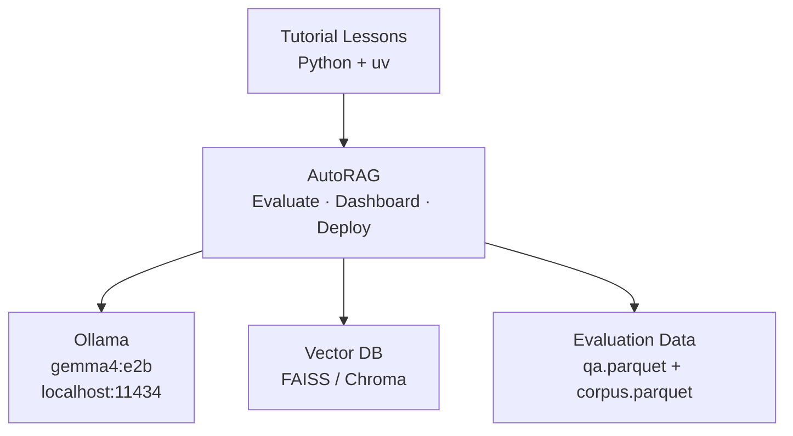

# AutoRAG Tutorial

A two-level tutorial for [AutoRAG](https://github.com/Marker-Inc-Korea/AutoRAG) — the open-source framework that applies AutoML-style automation to RAG pipeline optimization.

> You provide evaluation data, AutoRAG explores combinations of chunking strategies, embedding models, retrievers, rerankers, and generators, then identifies the best configuration for your data.

## Features

- **Hands-on lessons** — 12 self-contained lessons, each runnable with `uv sync && uv run python main.py`
- **Progressive difficulty** — Level 1 covers essentials, Level 2 covers advanced optimization and production integration
- **Local-first** — runs entirely on your machine with Ollama (no API keys required)
- **Real evaluations** — every lesson includes sample data and produces actual AutoRAG results
- **Production path** — Level 2 bridges from local optimization to OpenShift AI deployment

## Architecture



## Quick Start

### Prerequisites

- Python 3.10+
- [uv](https://docs.astral.sh/uv/) (Python package manager)
- [Ollama](https://ollama.ai) (local LLM inference)

### Setup

```bash
# Clone the repo
git clone https://github.com/lukaskellerstein/autorag-tutorial.git
cd autorag-tutorial

# Start Ollama and pull the model
ollama serve &
ollama pull gemma4:e2b

# Verify the setup
cd infra
uv sync
uv run python main.py
```

### Run a lesson

```bash
cd tutorial/level_1/M1_fundamentals/1_what_is_autorag/
uv sync
uv run python main.py
```

## Syllabus

### Level 1 — Essentials (~6-8 hours)

Understand AutoRAG, create evaluation data, run experiments, find the optimal RAG pipeline.

| Module | Lessons | Topics |
|--------|---------|--------|
| **M1: Fundamentals** | 1.1 What is AutoRAG | AutoML for RAG, pipeline nodes, greedy optimization |
| | 1.2 Installing & Setup | Project structure, data formats, CLI overview |
| **M2: Evaluation Data** | 2.1 Creating QA Datasets | LLM-generated QA pairs, quality review, train/test split |
| | 2.2 Preparing Corpus | Corpus format, preprocessing, metadata |
| **M3: Experiments** | 3.1 Configuration YAML | Node/module configuration, parameter grids |
| | 3.2 Running & Monitoring | Evaluation execution, progress tracking, dashboard |
| | 3.3 Analyzing & Deploying | Result interpretation, FastAPI deployment, config export |

### Level 2 — Practitioner (~4-5 hours)

Advanced optimization strategies, custom modules, and production deployment on OpenShift AI.

| Module | Lessons | Topics |
|--------|---------|--------|
| **M1: Advanced Optimization** | 1.1 Advanced Retrieval | Hybrid search, reranking, multi-stage retrieval |
| | 1.2 Embedding Comparison | Model benchmarking, cost-quality trade-offs |
| | 1.3 Custom Metrics | Domain-specific metrics, LLM-as-judge |
| **M2: Integration** | 2.1 Custom Modules | Custom chunkers, retrievers, generators |
| | 2.2 AutoRAG to OpenShift | Optimization → production deployment workflow |

Full details in [`syllabus.md`](syllabus.md).

## Project Structure

```
syllabus.md                              # Master syllabus
infra/                                   # Setup verification
  main.py                               #   Checks Ollama + AutoRAG
  pyproject.toml
tutorial/
  level_1/
    M1_fundamentals/
      1_what_is_autorag/                 # Each lesson is self-contained:
      2_installing_project_setup/        #   pyproject.toml, main.py,
    M2_evaluation_data/                  #   README.md, .gitignore
      1_creating_qa_datasets/
      2_preparing_corpus/
    M3_running_experiments/
      1_configuration_yaml/
      2_running_monitoring/
      3_analyzing_deploying/
  level_2/
    M1_advanced_optimization/
      1_advanced_retrieval/
      2_embedding_comparison/
      3_custom_metrics/
    M2_integration_production/
      1_custom_modules/
      2_autorag_to_openshift/
```

## Tech Stack

| Component | Tool | Purpose |
|-----------|------|---------|
| RAG optimization | [AutoRAG](https://github.com/Marker-Inc-Korea/AutoRAG) | Pipeline evaluation and selection |
| Package manager | [uv](https://docs.astral.sh/uv/) | Per-lesson dependency isolation |
| LLM inference | [Ollama](https://ollama.ai) | Local model serving (gemma4:e2b) |
| Data format | Parquet | QA datasets and corpus storage |
| Vector search | FAISS, Chroma, Qdrant | Retrieval backends |
| Embeddings | sentence-transformers, BGE, nomic | Document and query embedding |

## References

- [AutoRAG Documentation](https://marker-inc-korea.github.io/AutoRAG/)
- [AutoRAG GitHub](https://github.com/Marker-Inc-Korea/AutoRAG)
- [AutoRAG Research Paper](https://arxiv.org/html/2410.20878v1)
